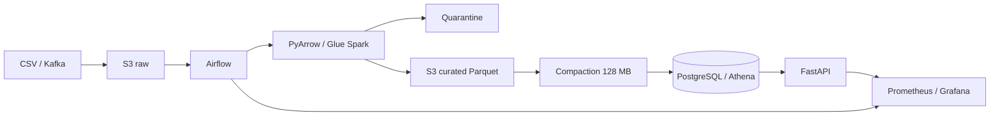

# Rentcars — Case Senior Data Engineer

Solução ponta a ponta para ingestão idempotente, data lake particionado, API versionada, observabilidade e infraestrutura AWS. A prioridade é correção financeira e operação previsível: raw imutável, dados inválidos em quarentena, serving reproduzível e custos visíveis.

## Execução local

Pré-requisito: Docker Compose v2. Na raiz:

```bash
docker compose up --build
```

O Compose inicia PostgreSQL, executa o pipeline inicial e só então libera API e observabilidade. Serviços:

| Serviço | URL / acesso |
|---|---|
| API / OpenAPI | `http://localhost:8000` / `http://localhost:8000/docs` |
| Airflow | `http://localhost:8080` — credenciais em `docker compose logs airflow \| grep password` |
| Prometheus | `http://localhost:9090` |
| Grafana | `http://localhost:3000` — `admin` / `admin` |
| PostgreSQL | `localhost:5432`, database/user `rentcars` |

API key local: `local-dev-key` no header `X-API-Key`. As senhas versionadas são exclusivamente de desenvolvimento; produção usa Secrets Manager.

Sem Docker:

```bash
make setup
make pipeline
make test
make api
```

Exemplo: `curl -H 'X-API-Key: local-dev-key' 'http://localhost:8000/v1/transactions/summary?start_date=2024-10-01&end_date=2025-03-31'`.

## Arquitetura



Localmente S3 é `data/lake`, PostgreSQL atende API e metadados do Airflow, Prometheus coleta API/exporter e Grafana é provisionado com datasource e dashboard. SQLite permanece apenas como adaptador leve dos testes. Em produção, S3 + Glue Catalog + Athena/Aurora substituem os adaptadores locais sem mudar contratos.

## Decisões importantes

- Eventos, pagamentos e transações são deduplicados antes de agregação; o critério vencedor é a chegada/offset mais recente. Reprocessar produz o mesmo estado.
- O checkpoint atômico fica em `data/state/checkpoints.json`. Eventos e transações reprocessam `[último checkpoint - watermark, agora]` (sete dias por padrão) e fazem upsert; pagamentos avançam por offset de cada partição. O checkpoint só é promovido depois de lake e PostgreSQL concluírem. Uma reconciliação mais larga pode usar `--full-refresh`; atrasado não significa inválido.
- Montantes negativos vão para quarentena, não são apagados. Bots ficam em dataset separado. Case de enums e códigos é normalizado.
- Catálogo usa schema superset nullable, preservando a versão da fonte. Isso acomoda adições compatíveis; breaking changes criam v2 da tabela/contrato.
- `ingest_date` dá pruning estável e rastreia chegada. Métricas por tempo de evento devem também filtrar a janela de ingestão necessária.
- `max_rows_per_file` previne fragmentação. `pipeline.compact` detecta toda partição com média abaixo de 128 MB e compacta as que têm múltiplos arquivos no modo local. `pipeline.spark_compaction` é o job Glue/EMR com `repartition`, `maxPartitionBytes` e `maxRecordsPerFile`. Em S3, a promoção deve usar staging + commit Iceberg/`REWRITE_DATA_FILES`, pois rename não é atômico.
- API key é suficiente para o case; produção usa API Gateway authorizer/JWT, WAF e quotas distribuídas. `/v1` recebe correções compatíveis; breaking changes entram em `/v2`, com deprecation headers e janela de 90 dias.

## Qualidade, observabilidade e operação

Os testes verificam unicidade, segregação de bots, valores negativos/quarentena, evolução v1/v2/v3, autenticação, contrato OpenAPI, incrementalidade e compactação com preservação de linhas. Rode `make test`. A DAG tem três retries exponenciais, callback de falha, SLA de duas horas e apenas uma execução ativa.

Prometheus recebe throughput/erros/latência da API; p95 é calculado com `histogram_quantile(0.95, ...)`. `observability/exporter.py` materializa métricas de `pipeline_runs.csv`. Alertas cobrem falhas acima de 15%, duração acima de 7200 s, lag acima de 300 s e arquivos por partição.

Para demonstrar idempotência/incrementalidade após o primeiro `up`:

```bash
docker compose run --rm pipeline
docker compose exec postgres psql -U rentcars -d rentcars \
  -c "select count(*) from events; select count(*) from transactions;"
```

A segunda execução deve informar `mode: incremental`, `payments: 0` quando não houver novos offsets, e manter as contagens no PostgreSQL. Um file lock compartilhado impede sobreposição entre execução local e Airflow. Para reconstrução controlada:

```bash
docker compose run --rm pipeline python -m pipeline.run --input data/raw \
  --output data/lake --checkpoint data/state/checkpoints.json --full-refresh
```

### Evidência de small files

```bash
make compact-demo
```

O comando cria 25 microarquivos em uma partição isolada, confirma a detecção abaixo de 128 MB, compacta para um arquivo e compara a quantidade de linhas antes/depois. Resultado validado: redução de 96% no file count e 2.500/2.500 linhas preservadas.

### Smoke e carga leve

```bash
make smoke
make load-test
```

O load test padrão envia 100 requests com concorrência 10 e falha se houver erro HTTP ou p95 acima de 1 segundo. Ele é um gate reproduzível, não substitui teste de capacidade distribuído com k6/Locust.

### Integração contínua

`.github/workflows/ci.yml` executa em push para `main` e pull requests:

1. compile e testes Python;
2. build das imagens e smoke API + PostgreSQL;
3. `terraform fmt`, `init -backend=false` e `validate`.

O lock file do provider AWS é versionado para builds determinísticos. Antes da submissão, publique o repositório e confirme os três jobs verdes na aba Actions.

## Estrutura

- `pipeline/`: transformação, compactação e DAG Airflow
- `api/`: FastAPI e endpoints `/v1`
- `tests/`: qualidade e integração
- `scripts/`: smoke/carga operacional
- `infra/`: imagem multi-stage e Terraform S3/KMS/IAM
- `observability/`: exporter e regras Prometheus
- `governance.md`: lineage, contrato, segurança, continuidade e FinOps

## Limitações e próximos passos

O case usa batch e offsets persistidos para simular streaming; produção requer Kinesis/Kafka com checkpoint externo e watermark nativo por event time. A promoção local de partições não oferece commit distribuído; Iceberg resolve ACID, upsert e compaction segura. Faltam deploy ECS/EKS, Glue Catalog, integração real com Secrets Manager, Alertmanager/notificações e teste de carga. O POST escreve no serving para demonstrar semântica; produção publica em Kinesis e responde 202 após confirmação do broker.

Estimativas e estratégia detalhada de custos, lifecycle, RPO/RTO e segurança estão em [governance.md](governance.md).
