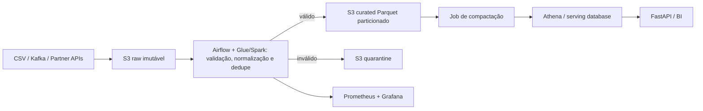

# Governança, segurança e FinOps

## Lineage e responsabilidades

O time Data Platform é owner do raw/curated e da plataforma. Analytics é owner das definições de funil; Finance valida receita. Todo artefato leva `run_id`, horário de ingestão e versão do código em produção.

## Data contract: `curated.events`

Granularidade: um evento não-bot por `event_id`. Chave: `event_id` UUID, não nula e única. Campos obrigatórios: `event_type`, `session_id`, `event_ts`, `device`, `country`, `ingest_date`. `user_id` é PII pseudonimizada; `metadata_json` permanece texto sem garantia sobre subcampos. Partição física: `ingest_date`; consumidores devem filtrar a partição.

- Owner: `data-platform@rentcars.com`; consumidores: Analytics, Growth, Partner Performance.
- Freshness: p95 menor que 60 minutos; disponibilidade mensal 99,5%.
- Watermark: 7 dias, configurável. A execução horária relê a janela `[último_watermark - 7d, agora]` e faz upsert por `event_id`. Registros posteriores são mantidos no raw e capturados por reconciliação diária de 30 dias.
- Mudanças breaking exigem nova versão/tabela e 90 dias de convivência; campos opcionais podem ser adicionados de modo backward-compatible.

## Evolução do catálogo

O raw é imutável e preserva `schema_version`. A staging projeta um superset v1/v2/v3: v1 recebe nulo para SLA/rating/endpoint/webhook; v2 recebe nulo para endpoint/webhook; v3 preenche todos quando fornecidos. Booleanos são normalizados sem depender de capitalização. Versões desconhecidas vão para quarentena e disparam alerta; nunca são descartadas silenciosamente.

## Segurança

S3 usa bloqueio público, versionamento e SSE-KMS com rotação anual. TLS 1.2+ protege trânsito. A role de pipeline acessa somente o bucket e a chave necessários; API e leitura analítica têm roles separadas. Secrets ficam no Secrets Manager, nunca em imagem ou Git. `user_id` é tokenizado com HMAC antes de curated; acesso ao raw é restrito e auditado por CloudTrail. Logs eliminam payloads, API keys e PII. Macie identifica vazamentos; GuardDuty e Security Hub centralizam achados.

## Continuidade

| Dataset | RPO | RTO | Proteção |
|---|---:|---:|---|
| raw | 15 min | 4 h | versionamento, CRR opcional, retenção 1 ano |
| curated | 1 h | 4 h | reproduzível do raw, versionamento |
| serving | 1 h | 2 h | backup diário + PITR |
| catálogo | 24 h | 4 h | versionamento e export diário |

Runbook: declarar incidente e congelar writers; identificar último checkpoint consistente; restaurar versão/PITR em ambiente isolado; validar contagem, unicidade e reconciliação financeira; trocar endpoint; reprocessar do raw de modo idempotente; registrar tempos e executar post-mortem. Restore é testado trimestralmente.

## FinOps

Premissa do case: 48 MB de CSV, aproximadamente 20 MB em Parquet; para uma estimativa útil de produção usamos 100 GB/dia raw, 40 GB/dia curated, retenção quente de 30 dias, 3 TB/mês consultados no Athena e 30 Glue DPU-h/mês. Preços são aproximações us-east-1 e devem ser recalculados na AWS Pricing Calculator antes de aprovação.

| Componente | Hipótese | Estimativa/mês |
|---|---|---:|
| S3 | ~4,2 TB quentes + requests | US$ 100–120 |
| Athena | 3 TB escaneados × US$5/TB | US$ 15 |
| Glue | 30 DPU-h × ~US$0,44 | US$ 13,20 |
| Transferência | 100 GB para internet × ~US$0,09 | US$ 9 |

No volume literal fornecido, todos ficam abaixo de US$1/mês, exceto mínimos operacionais. O maior risco é compute sem auto-stop (EMR/Glue) e, depois, Athena sem filtros: ambos escalam com uso, não apenas com dados armazenados.

Lifecycle de raw: Standard por 30 dias, Standard-IA até 90 e Glacier depois; curated fica Standard por 90 dias e Standard-IA até expirar. Para 4,2 TB, mover 70% de dados frios de Standard (~US$0,023/GB) para uma mistura IA/Glacier reduz storage de aproximadamente US$97 para US$45–55/mês, economia na ordem de 45–55%, antes de retrieval.

Batch tolerante a interrupção usa Spot com fallback on-demand; clusters têm auto-scaling, right-sizing via métricas e auto-termination em 10 minutos. Parquet, compressão, partition pruning, predicate pushdown e compactação de arquivos de ~128 MB reduzem scans e requests. Tags obrigatórias: `Team`, `Product`, `Environment`, `CostCenter`, `Owner`, validadas por policy. AWS Budgets alerta em 50/80/100%; Cost Anomaly Detection alerta variação diária anormal. Custo por run e TB processado vira SLO financeiro.

